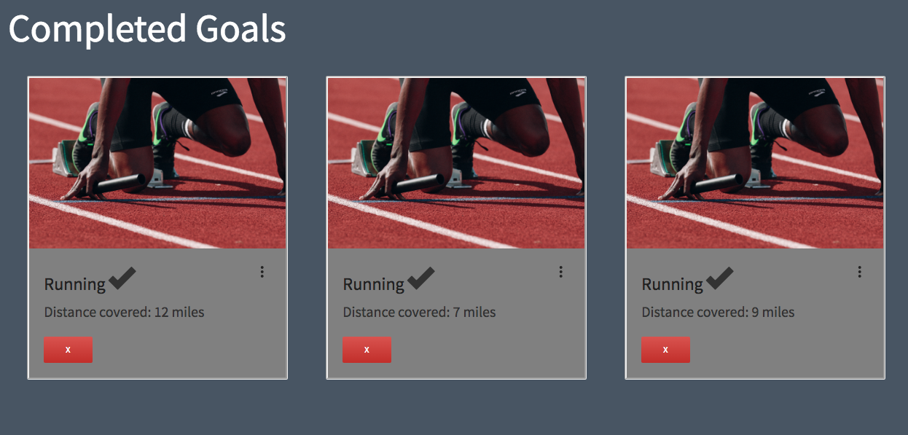

# 'gitFit' 

##### Install Instructions:

(TODO)

#### Team

gitFit is a simple MEAN Stack App collaborated on by:

* [Joshua Lovell](https://github.com/joshualyle)
* [Morgan Murrah](https://github.com/airbr)
* [Coredelle Smith](https://github.com/coredelle)
* [Benjamin West](https://github.com/benjaminwest1046)

#### Heroku Deployment

*Placeholder for Re-deploy*

[A live deploy of the initial version of the application (git tagged v1.0) can be viewed at this link on Heroku](https://intense-escarpment-84969.herokuapp.com/)

#### Project specs:

This project was originally created as a part of the WDI Curriculum to make an entry level MEAN Stack App: [Project 3 Requirements](https://github.com/ATL-WDI-Curriculum/projects/blob/master/project3.md). [The original Trello fro this project is at this link](https://trello.com/b/6o7h6Y7U/project3-fitness-todo-ish-app)

#### Technologies:

This app utilizes the MEAN Stack including:

* HTML5
* CSS3
* Materialize CSS Library
* Javascript
* NodeJS
* Express 
* AngularJS 
* Mongoose
* MongoDB 
* Toastr non-blocking notifications library

#### Development Log:

`v1.0` Is essentially the original gitFit app created in the space of three weeks, during the WDI course late 2016 in an excellent team effort.

`v2-Morgan` is my fork to revamp the application. Trying to get an old project to start is always a good way to jog the memory.

 
#### User Stories:

(Commented out, as was largely project result specific)

<!-- 
Maryann is a attorney that always has a full schedule. She constantly tries to fit working out into her daily regimen, but with all of the paperwork she handles on a regular basis she finds it hard to keep track of the notebook that she writes her workouts in. Luckily for her, she found the gitFit web app. With gitFit, she can not only access her workouts from anywhere, but she can monitor the details of her workouts and check them off as they are completed. She can create and delete new goals at her leisure and no longer has to worry about that pesky notebook.

Brian works out every day. He is training for a marathon that is coming up in three months and uses the gitFit app to schedule his runs ahead of time. He takes satisfaction in checking off his running goals and having them switch from the "Upcoming" category to the "Completed" category. That small action gives him the motivation to continue his training and compete at an elevated level. He plans to continue his use of the app even after his marathon, as he has plans to dabble in weight training afterwards.

Charlamagne hates working out. He needs to work out because he was informed by his doctor that his health is in jeopardy, but he finds it hard to get motivated. The only thing that keeps him going back on a regular basis is his gitFit app. A wave of guilt washes over him every time he allows one of his goals to expire without having been completed, so he does his best not to let it happen often. Charlamagne has been seeing improvements in his health since using the app, and he has recommended it to his friends.

-->
